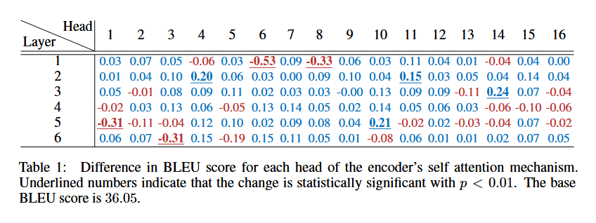
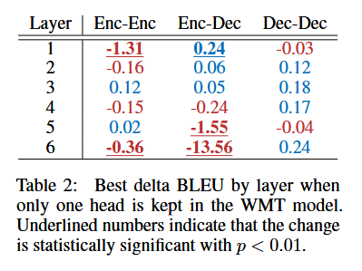

> # Are Sixteen Heads Really Better than One?
>
> * These models apply multiple attention mechanisms in parallel, with each attention “head” potentially focusing on different parts of the input, which makes it possible to express sophisticated functions beyond the simple weighted average
> * The authors make the surprising observation that even if models have been trained using multiple heads, in practice, a large percentage of attention heads can be removed at test time without significantly impacting performance. In fact, some layers can even be reduced to a single head.
>
> ## Detail
>
> * In this paper, we make the surprising observation that – in both Transformer-based models for machine translation and BERT-based (Devlin et al., 2018) natural language inference – most attention heads can be individually removed after training without any significant downside in terms of test performance. Remarkably, many attention layers can even be individually reduced to a single attention head without impacting test performance
> * Based on this observation, we further propose a simple algorithm that greedily and iteratively prunes away attention heads that seem to be contributing less to the model.
> * By jointly removing attention heads from the entire network, without restricting pruning to a single layer, we find that large parts of the network can be removed with little to no consequences, but that the majority of heads must remain to avoid catastrophic drops in performance.
> * We further find that this has significant benefits for inference-time efficiency, resulting in up to a 17.5% increase in inference speed for a BERT-based model.
> * A closer look at the case of machine translation reveals that the encoder-decoder attention layers are particularly sensitive to pruning, much more than the selfattention layers, suggesting that multi-headedness plays a critical role in this component
> * at test time, most heads are redundant given the rest of the model.
>
>   
> * We find that, for most layers, one head is indeed sufficient at test time, even though the network was trained with 12 or 16 attention heads.
>
>   
