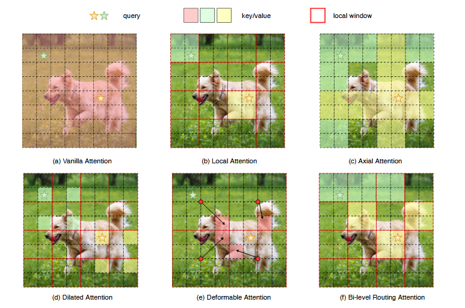
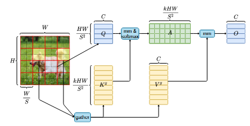
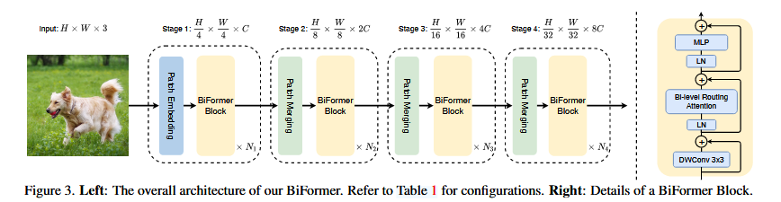

> # Biformer: Vision transformer with bi-level routing attention
>
> * The authors propose a novel dynamic sparse attention via bi-level routing to enable a more flexible allocation of computations with content awareness. We refer to this approach as Bi-level Routing Attention (BRA), as it contains a region-level routing step and a token-level attention step.
> * Specifically, for a query, irrelevant key-value pairs are first filtered out at a coarse region level, and then fine-grained token-to-token attention is applied in the union of remaining candidate regions (i.e., routed regions).
> * As BiFormer attends to a small subset of relevant tokens in a query adaptive manner without distraction from other irrelevant ones, it enjoys both good performance and high computational efficiency, especially in dense prediction tasks.
>
> ## Detail
>
> * queries in different semantic regions actually attend to quite different key-value pairs, The key observation which motivates our work is that the attentive region for different queries may differ significantly
> * To locate valuable key-value pairs to attend globally with high efficiency, we propose a region-to-region routing approach.
> * Our core idea is to filter out the most irrelevant key-value pairs at a coarse-grained region level, instead of directly at the fine-grained token level. This is done by first constructing a region-level affinity graph and then pruning it to keep only top-k connections for each node. Hence, each region only needs to attend to the top-k routed regions.
> * With the attending regions determined, the next step is to apply token-to-token attention, we propose a simple solution via gathering key/value tokens, where only hardwarefriendly dense matrix multiplications are involved.
> * Vanilla attention and its sparse variants. (a) Vanilla attention operates gloabally and incurs high computational complexity and heavy memory footprint. (b)-(d) Several works attempt to alleviate the complexity by introducing sparse attention with different handcrafted patterns, such as local window [27, 44], axial stripe [13], dilated window [39, 44]. (e) Deformable attention [45] enables image-adaptive sparsity via deforming a regular grid. (f) We achieve dynamic, query-aware sparsity with bi-level routing attention, which first searches top-k (k = 3 in this case) relevant regions, and then attends to the union of them.
>
>   
> * By gathering key-value pairs in top k related windows, we utilize the sparsity to skip computations in the most irrelevant regions, while only GPU-friendly dense matrix multiplications are involved:
>
>   
> * Overall architecture of BiFormer:
>
>   
