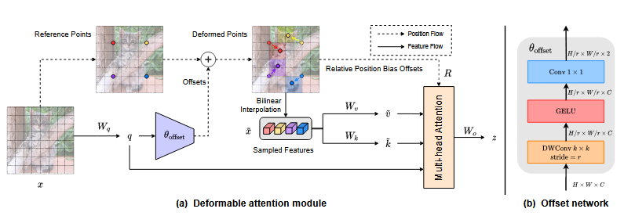

> # Vision Transformer with Deformable Attention
>
> * Simply enlarging receptive field also gives rise to several concerns. On the one hand, using dense attention e.g., in ViT, leads to excessive memory and computational cost, and features can be influenced by irrelevant parts which are beyond the region of interests. On the other hand, the sparse attention adopted in PVT or Swin Transformer is data agnostic and may limit the ability to model long range relations.\
> * To mitigate these issues, we propose a novel deformable self-attention module, where the positions of key and value pairs in self-attention are selected in a data-dependent way. This flexible scheme enables the self-attention module to focus on relevant regions and capture more informative features. On this basis, we present Deformable Attention Transformer, a general backbone model with deformable attention for both image classification and dense prediction tasks. we propose to learn a few groups of sampling offsets shared by all queries to shift keys and values to important regions
> * This design both holds a linear space complexity and introduces a deformable attention pattern to Transformer backbones.
>
> ## Detail
>
> * However, a naive implementation of learning a deformable receptive field leads to an unreasonably high memory/computation complexity: the overhead introduced by the deformable offsets is quadratic w.r.t the number of patches.
> * we propose to learn a few groups of sampling offsets shared by all queries to shift keys and values to important regions
> * This design both holds a linear space complexity and introduces a deformable attention pattern to Transformer backbones.
> * Specifically, for each attention module, reference points are first generated as uniform grids, which are the same across the input data. Then, an offset network takes as input all query features and generates the corresponding offsets for all reference points
> * In this way, the candidate keys/values are shifted towards important regions, thus augmenting the original self-attention module with higher flexibility and efficiency to capture more informative features.
> * Extensive experiments on ImageNet [9], ADE20K [41] and COCO [22] demonstrate that our model outperforms competitive baselines including Swin Transformer consistently, by a margin of 0.7 on the top-1 accuracy of image classification, 1.2 on the mIoU of semantic segmentation, 1.1 on object detection for both box AP and mask AP. The advantages on small and large objects are more distinct with a margin of 2.1.
> * An illustration of our deformable attention mechanism. (a) presents the information flow of deformable attention. In the left part, a group of reference points is placed uniformly on the feature map, whose offsets are learned from the queries by the offset network. Then the deformed keys and values are projected from the sampled features according to the deformed points, as shown in the right part. Relative position bias is also computed by the deformed points, enhancing the multi-head attention which outputs the transformed features. We show only 4 reference points for a clear presentation, there are many more points in real implementation de facto. (b) reveals the detailed structure of the offset generation network, marked with sizes of input and output feature maps for each layer
>   
