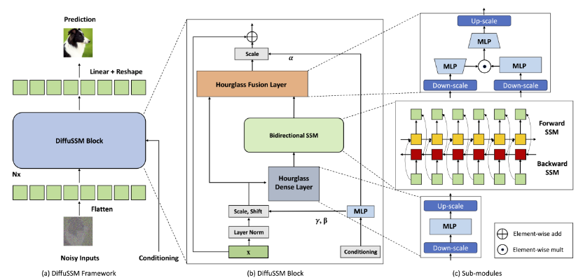

> # Diffusion Models Without Attention
>
> * Current methods, such as patchifying, expedite processes in UNet and Transformer architectures but at the expense of representational capacity. Addressing this, we introduce the Diffusion State Space Model (DIFFUSSM), an architecture that supplants(替代品) attention mechanisms with a more scalable state space model backbone.
> * DiffuSSMs are on par or even outperform existing diffusion models with attention modules in FID and Inception Score metrics while significantly reducing total FLOP usage.
> * **DIFFUSSM utilizes a gated state space model (SSM) backbone in the diffusion process，To further improve efficiency, DIFFUSSM employs an hourglass architecture for the dense components of the  network.**
>   Architecture of DIFFUSSM. DIFFUSSM takes a noised image representation which can be a noised latent from a variational encoder, flattens it to a sequence, and applies repeated layers alternating long-range SSM cores with hour-glass feed-forward networks. Unlike with U-Nets or Transformers, there is no application of patchification or scaling for the long-range block.
>
>   
> * Together these approaches target the asymptotic complexity of length as well as the practical efficiency in the position-wise portion of the network.
