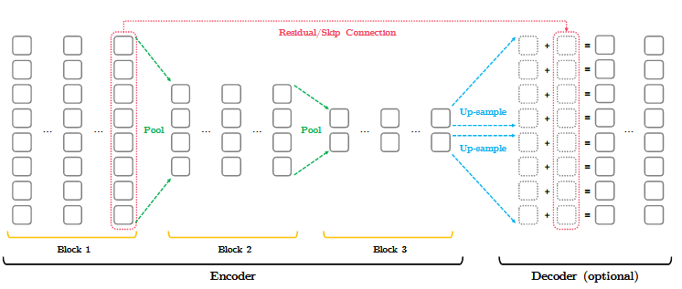

> # Funnel-Transformer: Filtering out Sequential Redundancy for Efficient Language Processing
>
> * To improve the efficiency, we examine the much-overlooked redundancy in maintaining a full-length token-level presentation, especially for tasks that only require a single-vector presentation of the sequence.
> * we propose Funnel-Transformer which gradually compresses the sequence of hidden states to a shorter one and hence reduces the computation cost，by re-investing the saved FLOPs from length reduction in constructing a deeper or wider model, we further improve the model capacity
> * In addition, to perform token-level predictions as required by common pretraining objectives, Funnel-Transformer is able to recover a deep representation for each token from the reduced hidden sequence via a decoder.
> * The similar conclusion applies to the B6-3x2-3x2 model, which has the same amount of parameters as the base model. The B4-4-4 model, which has the same depth and model parameters as the base model, is able to provide 30%-50% speedup without losing too much performance
>
> ## Detail
>
> * a common strategy is to identify redundant operations or representations and replace them with more efficient ones. Inspired by this line of thinking, in this work, we will be focusing on the potential redundancy induced by always maintaining a full-length sequence of hidden representations across all layers in Transformer
> * the most common use case is to extract a single vector from the entire sequence, which does not necessarily preserve all information down to the token-level granularity. Hence, for such tasks, the full-length sequence of hidden states may contain significant redundancy.
> * This is analogous to the case of image recognition, where the convolution neural network gradually reduces the spatial resolution/size of feature maps as the neural network goes deeper. In addition, linguistic prior also encourages gradually merging nearby tokens (words) into larger semantic units (phrases), which naturally leads to a shorter sequence of representations. Concretely, we propose to gradually reduce the sequential resolution (i.e. length) of the hidden representation in self-attention models.
> * In addition, to address the challenge that common pretraining objectives such as masked language modeling (MLM) [2] require separate representations for each token, we design a simple strategy to decode a full-length sequence of deep representations from the hidden state of reduced length.
> * To inherit the high capacity and optimization advantages of the Transformer architecture, the proposed model keeps the same overall skeleton of interleaved S-Attn and P-FFN sub-modules wrapped by residual connection and layer normalization. But differently, to achieve representation compression and computation reduction, our model employs an encoder that gradually reduces the sequence length of the hidden states as the layer gets deeper. In addition, for tasks involving per-token predictions like pretraining, a simple decoder is used to reconstruct a full sequence of token-level representations from the compressed encoder output.
>
>   
> * While these methods could potentially be plugged into our model as alternative compression operations, it remains an open question whether compression techniques developed for supervised graph classification can be extended the large-scale language pretraining.
> * The contracting encoder and expanding decoder framework with residual connections is conceptually similar to the ResUNet [24] for image segmentation. The strided pooling is also widely used to construct modern image recognition networks
