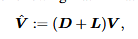
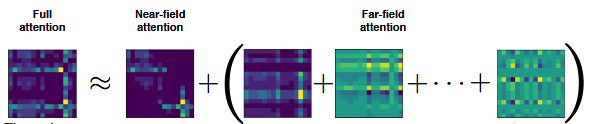

> # FMMformer: Efficient and Flexible Transformer via Decomposed Near-field and Far-field Attention
>
> * The authors propose FMMformers, a class of efficient and flexible transformers inspired by the celebrated fast multipole method (FMM) for accelerating interacting particle simulation
> * FMMformers decompose the attention into near-field and far-field attention, modeling the near-field attention by a banded matrix and the far-field attention by a low-rank matrix
> * Computing the attention matrix for FMMformers requires linear complexity in computational time and memory footprint with respect to the sequence length
>
> ## Detail
>
> * At the core of FMMformers is to replace the self-attention Vˆ = AV in (1) with the following matrix-matrix product:
>
>   where D is a banded matrix with bandwidth k N and L is a low-rank matrix of rank r N .
>
>   
> * Both DV and LV can be computed with linear computational and memory complexity; they model the near-field and far-field attention, respectively. FMMformers are flexible in designing the sparse banded matrix and the low-rank matrix for modeling near-field and far-field attention. In particular, we can control the bandwidth of the banded matrix D and the rank of the low-rank matrix L for expressivity and efficiency tradeoff.
> * Instead of modeling the full attention by a dense unstructured matrix, we employ a sparse banded matrix to model the near-field attention and several rank one matrices to model the far-field attention
>
>   
