> # Learning Rich Part Hierarchies with Progressive Attention Networks for Fine-Grained Image Recognition
>
> * This paper has propose a novel progressively-attention convolutional neural network , which referring  to PA-CNN, for progressively localize parts at multiple scales.
> * The PA-CNN contains two parts, part proposal network (PPN) and part  rectification network (PRN). PPN generates multiple local attention maps and PRN learns part-specific features from each proposal and provides the PPN with refined part location
> * the convolutional parameters for a PPN at finer scale can be inherited from the PRN at a coarser scale, enabling a rich part hierarchy to be  learned in a stacked fashion.
>
> [Learning Rich Part Hierarchies With Progressive Attention Networks for Fine-Grained Image Recognition | IEEE Journals & Magazine | IEEE Xplore](https://ieeexplore.ieee.org/abstract/document/8737007)
>
> ## Background
>
> * Fine-grained image recognition has received significant attention in both acdemia and industry in recent years (2018).fine-grained recognition aims to distinguish and represent the subtle visual differences within a sublevel class.
> * the notable things about fine-grained images are the samples in each dataset share a similar physical structure and sophisticated textures loacated in subtle parts are supposed to be well represented
> * Earlier part localization works leverage the extra annotations of bounding boxes and parts to to localize significant regions. Further studies have shown that discriminative parts can be localized in a weakly-supervised fashion convolutional neural network without human-annotated bounding box/part annotations. Although promising results have been reported, existing approaches predominantly attend on coarse parts.
> * However, it is challenging for current approaches to detect such fine-grained parts due to the imprecise localization from smoothed or even blurred feature maps. It makes small parts from neighboring regions indistinguishable from each other and neither of them can be localized precisely.
>
> ## Contributions
>
> * The paper proposes a novel progressive-attention convolutional neural network which can learn rich part hierarchies for fine-grained image recognition.
> * The paper designs a learning mechanism which optimizes a part proposal sub-network and a part rectification sub-network in a mutually reinforeced way.
> * In experiments conducted on three challenging datasets, PA-CNN achieves state-of-the-art performance.
>
> ## Related Work
>
> * Part Localization
>   Most Paet-based methods focus on learning explicit part localizations,  which involves either supervised part detection technique or unsupervised/weakly supervised attention learning.
> * Feature Representation
>   After the Bilinear-CNN published, high-order feature became a hot-discussed topic in the community.
>
> ## Approach
>
> * The proposed progressive-attention convolutional neural network (PA-CNN) is composed of part proposal and part rectification sub-networks.
> * First, the PPN takes as input an image in (a) and produces multiple part attentions in (c), which are then cropped to give the part proposals in (d). Next, these part proposals are taken as input by PRN, which independently learns fine-grained features from each of them to generate more precise local attention in (f). These rectified attentions from the PRN are used to refine the PPN attentions via a rectification loss, and with this coupling of networks, the PPN and PRN are jointly trained in a manner that mutually reinforces each other. The convolutional parameters are then passed from the PRN to the PPN, and the part learning procedure is repeated to progressively generate finer-grained parts and features in the hierarchical model.
>
>   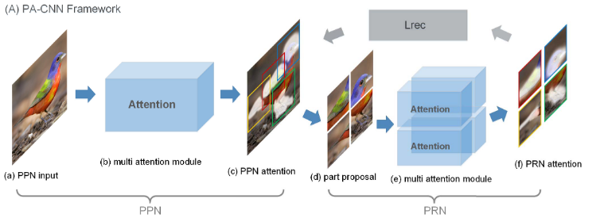
> * Each channel of feature maps can be represented as a vector whose element are the coordinates of the peak repon ses over all train image instances, where Ω is the number of training images, and i-x, i-y are the coordinates of the peak response of the i-th image in training set. Several channels of feature maps have reponses to the same semantic part, so if two feature channels describe the same part, their responses on each training sample are suppoesd to the near, the Euclidean distance of their coordinates are small.
>
>   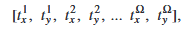
> * We consider the position vector as features, and cluster different channels into N groups as N part detectors.where c is the number of convolution feature channels.
>
>   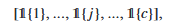
> * To ensure the channel grouping operation can be optimized in training, we approximate thia grouping by proposing channel grouping layers to regress the permutation over channels.
> * To learn N attention maps for an image, channel grouping layers are designed to consist of N multilayer perceptron(MLP). Each MLP-i (from 1 to N) takes as input global pooled convolutional features, and produce a weight vector d-i over different channels(form 1 to c), the c is the number of convolution feature channels.
> * MLP is composed of two fully-connected layers, use tanh as the activation function after the first FC, the sigmoid function after the second one.
>
>   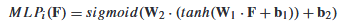
> * To obtain the channel grouping result di(X) by two steps:1) pre-train Wa by fitting di(X) to cluster vector; 2) further optimizing by end-to-end part learning.
> * We enforce each channel to belong to only one cluster by a loss function
> * We further obtain the part attention map for the i-th part, [F]-j denotes the j-th feature channel of convolutional features F.
>
>   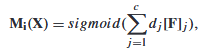
> * the final convolutional featuer representation for the i-th part is calculated via spatial pooling on each channel.
>
>   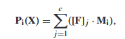
> * The proposed multiple attention module is optimized by two types of supervision, part classification loss and channel grouping loss.In blow Equ, Y-i denotes the predicted label vector from the i-th part by using part-based feature P-i
>
>   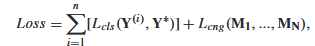
> * In the below Equ(channel grouping loss), the  Dis is a distance function, which encourages a compact distribution and the Div is a diversity function, which is designed to favor a diverse attention distribution from different part attention maps.
>
>   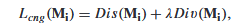
> * This is a part attention maps in an iteration over the head and wing for a bird, with the brighter the area, the higher the reponses for attention.
>
>   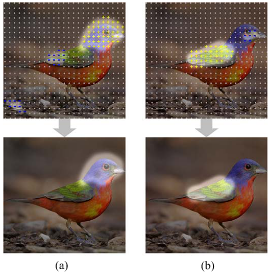
> * Structure of PPN and PRN: The PPN contains a multiple attention module, the PPN first generates n attention maps. Considering a single map for simplicity, we denote it as Mp and obtain a part proposal from it by cropping a square patch from the original image based on Mp, The patch is magnified to a higher resolution and then denoted as Xp.
>
>   The attention modules for PRN shares a similar structure and supervision with that in the PPN, except that the input is a part proposal and the output is a single attention map. For each part proposal Xp, there is a corresponding fully convolutional attention module, which generates a single attention map Mr.
> * The attention maps generated by the PRN are much more accurate than those generated by the PPN, because 1) the inputs of the PRN are patches magnified from a small region, which reduce the mixing of region context caused by stacked convolutions and pooling operations; and 2) the CNN and attention model are learned for a specific part, which ensures that the semantic distinctness of each part is preserved.
>
>   To rectify the attention maps of the PPN, we design a rectification loss Lrec, where Rec(x1, x2) indicates optimizing x2 to fit x1. Mp is attention maps generated from PPN, Mr is attention map generated from PRN.
>
>   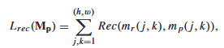
> * Training Strategy: After following this algorithm to obtain the first-scale parts, we change the inputs of the PPN from the original image to the learned parts (e.g., head of a bird) and repeat the algorithm. Continuing this cycle produces a stack of progressively more fine-grained parts (e.g., locating the eye and beak), thus generating a rich part hierarchy.
> * Hierarchical Representation for Recognition: local features are first extracted from the detected parts by fine-tuned CNNs, and then the part features are deeply fused with global feature extracted from the full image for recognition. As both our model and the detected parts are hierarchical, a hierarchical representation is obtained for recognition.
>
>   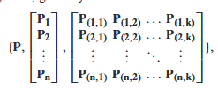
>
> ## Experiments
>
> 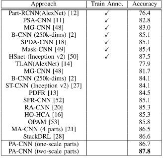
>
> 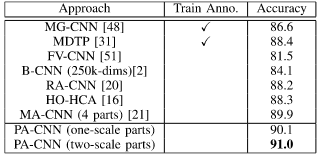
