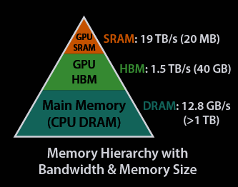
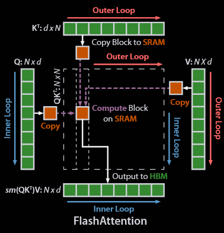

> # FLASHATTENTION: Fast and  Memory-Efficient Exact Attention with IO-Awareness
>
> * FlashAttention is an IO-aware exact attention algorithm that uses tiling to reduce the number of memory reads/writes between GPU high bandwidth memory (HBM) and GPU on-chip SRAM.  In figure 1, we talk about the Memory Hierarchy with Bandwidth & Memory Size in the GPU. The algorithm avoids reading and writing the attention matrix to and from HBM. This requires (i) computing the softmax reduction without access to the whole input (ii) not storing the large intermediate attention matrix for the backward pass. As showed in Figure 2, In the outer loop (red arrows), FLASHATTENTION loops through blocks of the K and V matrices and loads them to fast on-chip SRAM. In each block, FLASHATTENTION loops over blocks of Q matrix (blue arrows), loading them to SRAM, and writing the output of the attention computation back to HBM.
>
>   
>
>   
