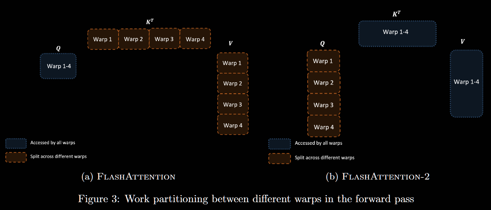

> # FlashAttention-2:  Faster Attention with Better Parallelism and Work Partitioning
>
> * While FlashAttention is already 2-4× faster than a standard attention implementation, the forward pass only reaches 30-50% of the theoretical maximum FLOPs/s of the device , while the backward pass is even more challenging, reaching only 25-35% of maximum throughput on A100 GPU . Because FlashAttention still has suboptimal work partitioning between different thread blocks and warps on the GPU, causing either low-occupancy or unnecessary shared memory reads/writes. So Building on FlashAttention, Authors propose FlashAttention-2 with better parallelism and work partitioning to address these challenges. In particular, First they tweak the algorithm to reduce the number of non-matmul FLOPs, because GPUs have specialized units for matrix multiply, and as a result the matmul throughput can be up to 16× higher than non-matmul throughput. Then They parallelize the attention computation, even for a single head, across different thread blocks to increase occupancy, and  within each thread block, distribute the work between warps to reduce communication through shared memory. FlashAttention-2 achieves around 2× speedup over FlashAttention, reaching up to 73% of the theoretical max throughput in the forward pass, and up to 63% of the theoretical max throughput in the backward pass.
> * In FlashAttention-2, we instead split Q across 4 warps while keeping K and V accessible by all warps. After each warp performs matrix multiply to get a slice of QK⊤, they just need to multiply with their shared slice of V to get their corresponding slice of the output. There is no need for communication between warps. The reduction in shared memory reads/writes yields speedup (Section 4).
>
>   
