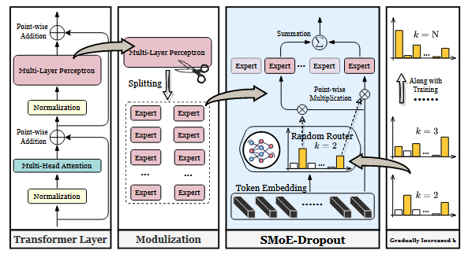

> # Sparse MoE as the new dropout: Scaling dense and self-slimmable transformers(for performance , not efficiency)
>
> * Sparsely-activated Mixture-of-Experts (SMoEs) have shown promise to mitigate the issue of training efficiency, yet they are prone to (1) redundant experts due to representational collapse; and (2) poor expert scalability for inference and downstream fine-tuning, primarily due to overfitting of the learned routing policy to the number of activated experts during training.
> * As recent research efforts are predominantly focused on improving routing policies to encourage expert specializations,
> * SMoE-Dropout employs a fixed router network that is randomly initialized to activate experts and progressively increases their number as training progresses over time.
> * this work focuses on exploring the overlooked scalability bottleneck of SMoEs and leveraging it to effectively scale dense transformers. To this end, we propose a new plug-and-play training framework, SMoEDropout, to enable scaling transformers to better accuracy in their full capacity without collapse. Specifically, SMoE-Dropout consists of a randomly initialized and fixed router network to activate experts and gradually increases the activated expert number as training progresses over time.
> * In terms of training efficiency, SMoE-Dropout has up to 21%, 37%, and 25% training time savings compared to the dense training of three backbones. If only half of the experts (k = N  2 ) are activated, our approach enjoys extra 23% ∼ 34% inference  FLOPs reduction with a comparable BPC. Although the learnable SMoE reaches the best efficiency, it results in inferior performance.
> * In particular, our trained BERT outperforms its densely trained counterpart with consistent improvements of {1.03%, 0.78%, 1.09%} on challenging reasoning tasks {ASDiv-A, MAWPS, SVAMP}, respectively.
>
> ## Detale
>
> * SMoE-Dropout employs a fixed router network that is randomly initialized to activate experts and progressively increases their number as training progresses over time.
> * Figure 2: Overview of our proposed SMoE-Dropout. Left describes the standard transformer layer, consisting of multi-head attention and multi-layer perceptron (MLP) components. Middle Left shows the process of modulization. It splits the original MLP evenly and constructs a series of experts which are smaller MLPs with a reduced hidden dimension. Middle Right presents the overall procedure of SMoE-Dropout. The random router selects the top-k experts given a token embedding and then reweights the features from activated experts. In the end, a summation is conducted to aggregate all features. Right displays the gradually increased number of chosen experts, along with the training procedure.
>
>   In our proposal, the fixed router with random weights generates deterministic inferences. Meanwhile, the presented “self-slimmable” attribute suggests the full models’ expressiveness is adequately exploited.
>
>   
