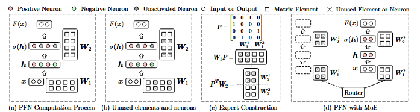

> # MoEfication: Transformer Feed-forward Layers are Mixtures of Experts
>
> * However, the computational patterns of FFNs are still unclear. In this work, we study the computational patterns of FFNs and observe that most inputs only activate a tiny ratio of neurons of FFNs.
> * To verify whether functional partitions also emerge in FFNs, we propose to convert a model into its MoE version with the same parameters, namely MoEfication. Specifically, MoEfication consists of two phases: (1) splitting the parameters of FFNs into multiple functional partitions as experts, and (2) building expert routers to decide which experts will be used for each input.
> * Experimental results show that MoEfication can conditionally use 10% to 30% of FFN parameters while maintaining over 95% original performance for different models on various downstream tasks. Besides, MoEfication brings two advantages: (1) it significantly reduces the FLOPS of inference, i.e., 2x speedup with 25% of FFN parameters,
>
> ## Detail
>
> * To investigate this problem, we explore whether a Transformer can be converted into an equivalent Mixture-of-Experts (MoE) model (Bengio, 2013), which regards different functional partitions in FFNs as different experts conditionally activated. Specially, we propose MoEfication to discover the functional partitions (experts) in FFNs and build routers for selecting experts. It consists of two phases. (1) Expert Construction: Split a whole feed-forward layer into multiple experts. The goal is to group those neurons that are often activated simultaneously into the same expert network. (2) Expert Selection: Select those experts that contain as many activated neurons as possible for each input to approximate to the original results.
> * Figure 1: An example of the sparse activation phenomenon and MoEfication. (a) shows the computation process of an FFN for a given input. (b) shows the unused elements and neurons for this input. (c) shows how to construct experts. (d) shows how the MoEfied model handles this input efficiently.
>   
