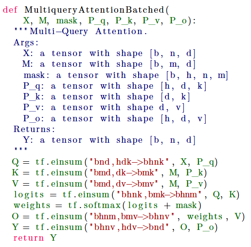
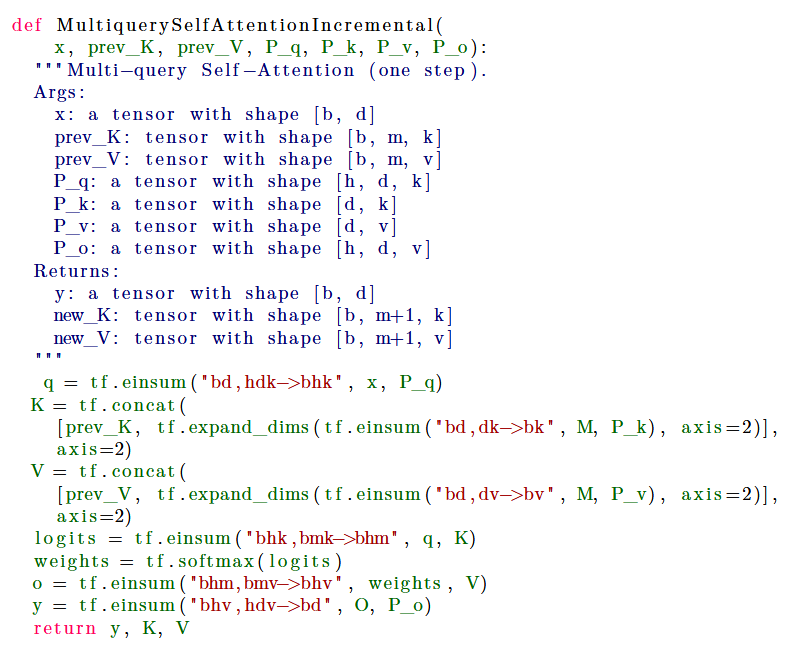

> # Fast Transformer Decoding: One Write-Head is All  You Need
>
> * incremental inference (where such paralleization is impossible) is often slow, due to the memory-bandwidth cost of repeatedly loading the large "keys" and "values" tensors
> * We propose a variant called multi-query attention, where the keys and values are shared across all of the different attention "heads", greatly reducing the size of these tensors and hence the memory bandwidth requirements of incremental decoding.
>
> ## Detail
>
> * We ran incremental greedy inference on a batch of 1024 sequences (128 per core) using a source-sequence length of 128 tokens and a target sequence length of 128. 1 For the baseline model, the encoder part of the model took 222ms and each incremental step of the decoder took 47ms. Dividing by the respective numbers of tokens, we find that the amortized inference time is 1.7μs per token for the encoder and a much larger 46μs per token for the decoder, as listed in Table 2. For the multi-query model, the encoder took 195ms and the decoder took 3.9ms per step, for amortized per-token costs of 1.5μs and 3.8μs respectively. Table 2 shows these values as well as similar results for beam-search.
>   
>
>   
