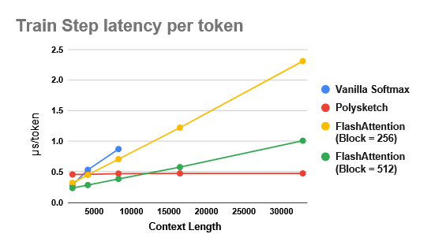
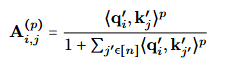

> # Polysketchformer: Fast transformers via sketches for polynomial kernels
>
> * Recent theoretical results indicate the intractability of sub-quadratic softmax attention approximation under reasonable complexity assumptions.
> * This paper addresses this challenge by first demonstrating that polynomial attention with high degree can effectively replace softmax without sacrificing model quality
> * Next, we develop polynomial sketching techniques from numerical linear algebra to achieve linear-time polynomial attention with approximation guarantees.
> * We also present a block-based algorithm to apply causal masking efficiently. Combining these techniques, we provide PolySketchFormer,
>
> ## Detail
>
> * Train step latency per token in μs/token of GPT-2 small style models with softmax attention (FlashAttention) v.s. ours. Each model is trained with 1M tokens batches. Vanilla softmax attention goes out-of-memory (OOM) for context lengths > 8k.
>
>   
> * Polynomial similarity kernel function of high degree. To tackle the first part of the above question, we explore the power of the polynomial kernel function σ(x, y) = ⟨x, y⟩p for large even degrees p ≥ 4 empirically for language modelling tasks
> * where q′  i, k′  j are obtained by applying the layer normalization layer to qi, kj respectively.
>
>   
> * In practice, the head size h is usually 64, 128 or even 256 (Chowdhery et al., 2023). Therefore, computing the exact feature mapping for p ≥ 4 is still expensive. To address this issue, we apply the sketching technique from the numerical linear algebra literature to compute a low-dimensional approximate feature mapping φ′ such that ⟨φ′(x), φ′(y)⟩ ≈ ⟨x, y⟩p.
> * Block-based lower triangular multiplication for handling causal masks. Another bottleneck in applying attention linearization techniques in training transformer models with causal masking on long contexts is to handle a huge number of sequential gradients update due to RNN-style sequential state updates
