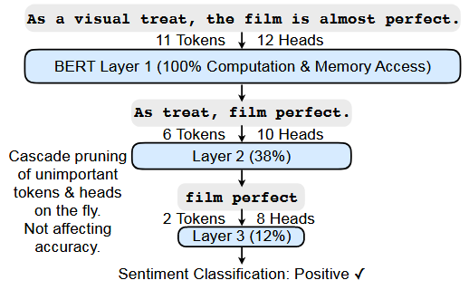
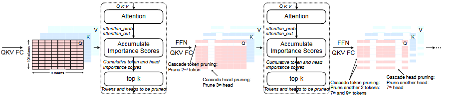
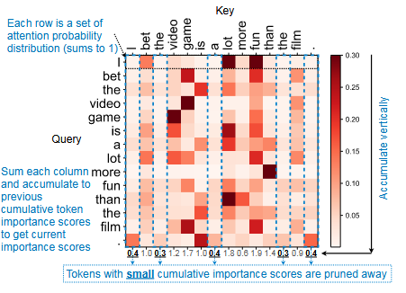
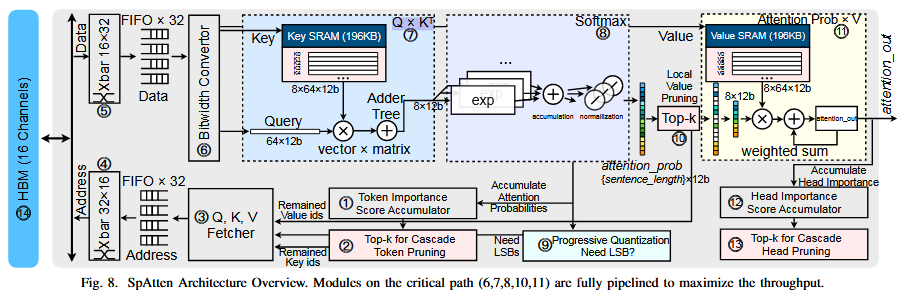

> # SpAtten: Efficient Sparse Attention Architecture  with Cascade Token and Head Pruning
>
> ## Conclusion
>
> * because of attention's quadratic computational complexity to input length, complicated data movement and low arithmetic intensity, it becomes the computation bottleneck.
> * In this paper, authors present SpAtten,an algorithmarchitecture co-design to enable efficient attention inference. We propose three algorithmic optimizations: cascade token pruning, cascade head pruning and progressive quantization to reduce computation and memory access. an efficient algorithm-architecture co-design that leverages token sparsity, head sparsity, and quantization opportunities to reduce the attention computation and memory access.
>
>   SpAtten reduces DRAM access by 10.0× with no accuracy loss, and achieves 1.6×, 3.0×, 162×, 347× speedup, and 1.4×, 3.2×, 1193×, 4059× energy savings over A3 accelerator, MNNFast accelerator, TITAN Xp GPU, Xeon CPU, respectively.
>
> ## Details
>
> * Inspired by the high redundancy of human languages, we propose the novel cascade token pruning to prune away unimportant tokens in the sentence. We also propose cascade head pruning to remove unessential heads.
> * To efficiently support them on hardware, we design a novel top-k engine to rank token and head importance scores with high throughput.
> * we propose progressive quantization that first fetches MSBs only and performs the computation; if the confidence is low, it fetches LSBs and recomputes the attention outputs, trading computation for memory reduction.
> * Different from conventional techniques, pruning is applied to the tokens and heads, not weights.
> * Cascade means: once a token/head is pruned, it is removed in all following layers, so one layer only needs to process remaining tokens/heads from previous layers.The deeper the layer, the more tokens/heads are pruned.
> * Cascade pruning requires sorting token/head importance scores on the fly. Thus we design hardware architecture with highparallelism top-k engines for token/head selections, specialized memory hierarchy, and fully-pipelined datapath to translate theoretical savings to real speedup and energy reduction.
> * Cascade token and head pruning removes redundant tokens and heads globally across layers. Evaluated with BERT-Base on SST-2 dataset:
>
>   
> * Cascade token pruning removes redundant tokens and corresponding entire Q K V vectors according to the cumulative token importance scores computed from attention prob. Cascade head pruning removes unimportant heads and corresponding chunks in all Q K V vectors according to the cumulative head important scores computed from attention out. Once a token/head is pruned, it will never appear in any following layers, thus named cascade pruning. More tokens and heads are pruned away as the layer goes deeper:
>
>   
> * Attention probabilities for BERT are summed over each column to get importance scores. Tokens with small importance scores are pruned:
>
>   
> * SpAtten Architecture Overview:
>
>   
