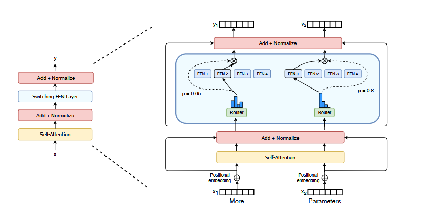

> # Switch transformers: Scaling to trillion parameter models with simple and efficient sparsity
>
> * However, despite several notable successes of MoE, widespread adoption has been hindered by complexity, communication costs, and training instability.
> * We address these with the introduction of the Switch Transformer. We simplify the MoE routing algorithm and design intuitive improved models with reduced communication and computational costs.
> * In our case the sparsity comes from activating a subset of the neural network weights for each incoming example
> * we instead use a simplified strategy where we route to only a single expert. We show this simplification preserves model quality, reduces routing computation and performs better.
> * Our proposed training techniques mitigate the instabilities, and we show large sparse models may be trained, for the first time, with lower precision (bfloat16) formats. We design models based off T5-Base and T5-Large (Raffel et al., 2019) to obtain up to 7x increases in pre-training speed with the same computational resources.
> * we advance the current scale of language models by pre-training up to trillion parameter models on the “Colossal Clean Crawled Corpus”, and achieve a 4x speedup over the T5-XXL model
>
> ## Detail
>
> * we instead propose a sparsely-activated expert model: the Switch Transformer. In our case the sparsity comes from activating a subset of the neural network weights for each incoming example
> * To have an efficient sparse algorithm, we start with the Mixture-of-Expert (MoE) paradigm and simplify it to yield training stability and computational benefits.
> * We achieve this by designing a sparsely activated model that efficiently uses hardware designed for dense matrix multiplications such as GPUs and TPUs.and simplify it to yield training stability and computational benefits. In our distributed training setup, our sparsely activated layers split unique weights on different devices. Therefore, the weights of the model increase with the number of devices, all while maintaining a manageable memory and computational footprint on each device.
> * Illustration of a Switch Transformer encoder block. We replace the dense feed forward network (FFN) layer present in the Transformer with a sparse Switch FFN layer (light blue). The layer operates independently on the tokens in the sequence. We diagram two tokens (x1 = “More” and x2 = “Parameters” below) being routed (solid lines) across four FFN experts, where the router independently routes each token. The switch FFN layer returns the output of the selected FFN multiplied by the router gate value (dotted-line).
>
>   
> * Contrary to these ideas, we instead use a simplified strategy where we route to only a single expert. We show this simplification preserves model quality, reduces routing computation and performs better.
