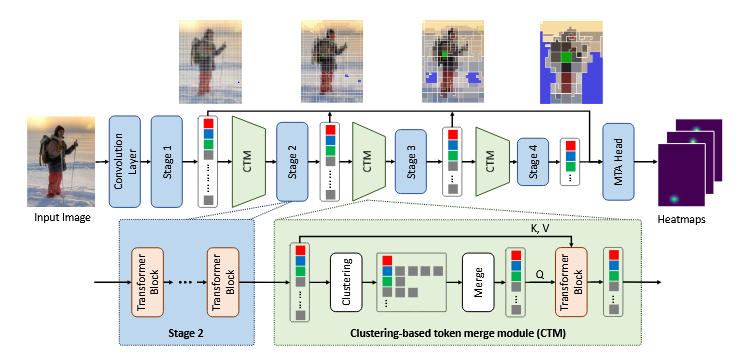

> # Not All Tokens Are Equal: Human-centric Visual Analysis via Token Clustering Transformer
>
> * Most methods generate vision tokens by splitting an image into a regular and fixed grid and treating each cell as a token. However, not all regions are equally important in human-centric vision tasks. However, fixed grid based vision tokens are sub-optimal for human-centric visual analysis. In human-centric visual analysis, the image regions of the human body are more crucial than the image background, motivating us to represent different image regions by vision tokens with dynamic shape and size 1. But the token regions of the grid-based vision tokens are rectangular areas with fixed location, shape and size. Uniform vision token distribution is not able to allocate more tokens to important areas.
> * To address this problem, we propose a novel Vision Transformer, called Token Clustering Transformer (TCFormer), which merges tokens by progressive clustering, where the tokens can be merged from different locations with flexible shapes and sizes. The tokens in TCFormer can not only focus on important areas but also adjust the token shapes to fit the semantic concept and adopt a fine resolution for regions containing critical details, which is beneficial to capturing detailed information.
> * Overview of Token Clustering Transformer (TCFormer). Given an input image, feature map is extracted with a single convolution layer and pixels in the feature map is regarded as initial vision tokens. These initial vision tokens are processed in a multi-stage manner and every stage is composed of multiple stacked transformer blocks. At the end of every stage, vision tokens are merged with a Clustering-based Token Merge (CTM) block to generate tokens for the next stage. Finally, all vision tokens are fed into the Multi-stage Token Aggregation (MTA) head for predicting heatmaps. In the CTM block, input tokens are first clustered and then merged by weighted averaging. Merged tokens and original tokens are then fed into a transformer block for better feature aggregation
>
>   
