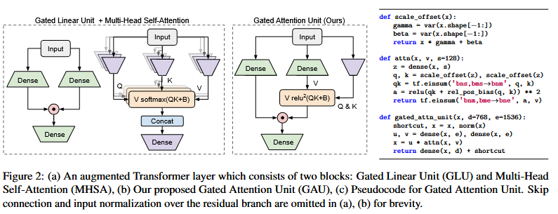

> # Transformer quality in linear time
>
> * Inferior Quality. Our studies reveal that vanilla Transformers, when augmented with several simple tweaks, can be much stronger than the common baselines used in the literature (see Transformer vs. Transformer++ in Figure 1). Existing efficient attention methods often incur significant quality drop compared to augmented Transformers, and this drop outweighs their efficiency benefits.  • Overhead in Practice. As efficient attention methods often complicate Transformer layers and require extensive memory re-formatting operations, there can be a nontrivial gap between their theoretical complexity and empirical speed on accelerators such as GPUs or TPUs.  • Inefficient Auto-regressive Training. Most attention linearization techniques enjoy fast decoding during inference, but can be extremely slow to train on auto-regressive tasks such as language modeling. This is primarily due to their RNN-style sequential state updates over a large number of steps, making it infeasible to fully leverage the strength of modern accelerators during training.
> * We address the above issues by developing a new model family that, for the first time, not only achieves parity with fully augmented Transformers in quality, but also truly enjoys linear scalability over the context size on modern accelerators.
> * First, we propose a new layer that is more desirable for effective approximation. We introduce a gating mechanism to alleviate the burden of self-attention, resulting in the Gated Attention Unit (GAU)
>
>   
> * We then propose an efficient method to approximate the quadratic attention in GAU, The key idea is to first group tokens into chunks, then using precise quadratic attention within a chunk and fast linear attention across chunks,
>
>   
> * For example, with comparable quality, FLASH achieves a speedup of 1.2×4.9× for language modeling on Wiki-40B and a speedup of 1.0×–4.8× for masked language modeling on C4 over Transformer++. As we further scale up to PG-19 (Rae et al., 2019), FLASH reduces the training cost of Transformer++ by up to 12.1× and achieves significant gain in quality
