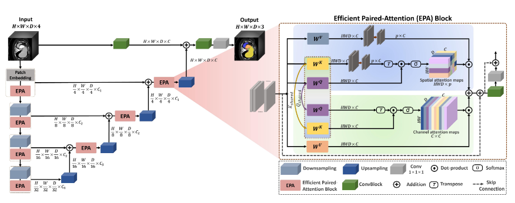

> # UNETR++: Delving into Efficient and Accurate 3D Medical Image Segmentation
>
> * However, the selfattention operation has quadratic complexity which proves to be a computational bottleneck, especially in volumetric medical imaging, where the inputs are 3D with numerous slices. These works mainly focus on increasing the segmentation accuracy which in turn substantially increases the model sizes in terms of both parameters and FLOPs, leading to unsatisfactory robustness.
> * In this paper, we propose a 3D medical image segmentation approach, named UNETR++, that offers both high-quality segmentation masks as well as efficiency in terms of parameters, compute cost, and inference speed.
> * The core of our design is the introduction of a novel efficient paired attention (EPA) block that efficiently learns spatial and channel-wise discriminative features using a pair of inter-dependent branches based on spatial and channel attention. Our spatial attention formulation is efficient having linear complexity with respect to the input sequence length. To enable communication between spatial and channel-focused branches, we share the weights of query and key mapping functions that provide a complimentary benefit (paired attention), while also reducing the overall network parameters.
>
> ## Detail
>
> * On Synapse, our UNETR++ sets a new state-of-the-art with a Dice Score of 87.2%, while being significantly efficient with a reduction of over 71% in terms of both parameters and FLOPs, compared to the best method in the literature.
> * Our spatial attention in EPA projects the keys and values to a fixed lower dimensional space, making the self-attention computation linear with respect to the number of input tokens.  On the other hand, our channel attention emphasizes the dependencies between the channel feature maps by performing the dot-product operation between queries and keys in the channel dimension. Further, to capture a strong correlation between the spatial and channel features, the weights for queries and keys are shared across the branches which also aids in controlling the number of network parameters. In contrast, the weights for values are kept independent to enforce learning complementary features in both branches.
> * Overview of our UNETR++ approach with hierarchical encoder-decoder structure. The 3D patches are fed to the encoder, whose outputs are then connected to the decoder via skip connections followed by convolutional blocks to produce the final segmentation mask. The focus of our design is the introduction of an efficient paired-attention (EPA) block (Sec. 3.2). Each EPA block performs two tasks using parallel attention modules with shared keys-queries and different value layers to efficiently learn enriched spatial-channel feature representations. As illustrated in the EPA block diagram (on the right), the first (top) attention module aggregates the spatial features by a weighted sum of the projected features in a linear manner to compute the spatial attention maps, while the second (bottom) attention module emphasizes the dependencies in the channels and computes the channel attention maps. Finally, the outputs of the two attention modules are fused and passed to convolutional blocks to enhance the feature representation, leading to better segmentation masks.
>
>   
