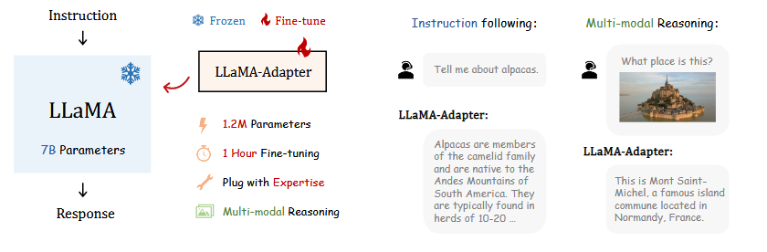
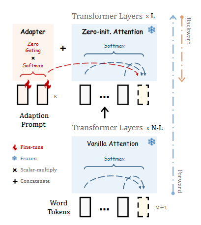

> # LLaMA-Adapter: Efficient Fine-tuning of Large Language Models with Zero-initialized Attention
>
> * However, the further prevalence of  instruction models is largely impeded by the closed-source restriction and high development costs
> * we present LLaMA-Adapter, a lightweight adaption method  for efficient instruction tuning of LLaMA. Using 52K self-instruct demonstrations, LLaMA-Adapter only introduces 1.2M learnable parameters upon the frozen  LLaMA 7B model, and costs less than one hour for fine-tuning. Specifically, a  zero-initialized attention mechanism is proposed. It adopts a learnable zero gating  to adaptively inject the instructional cues into LLaMA within self-attention layers,  contributing to a stable training process and superior final performance.
>
>   Specifically, in LLaMA’s higher transformer layers, we append  a set of learnable adaption prompts as prefixes to the word tokens. To avoid the noise from  randomly initialized prompts at the early training stage, we equip the frozen self-attention layers  with a learnable gating factor. The gating mechanism is initialized by zeros, and controls the feature  interaction between prompt and word tokens, within the process of attention calculationSuch  a strategy can first preserve the original knowledge in LLaMA, and progressively inject the new  instructional signals during training.
>
>   
> * Besides  language commands, by incorporating an image encoder, our approach can be  simply extended to a Multi-modal LLM
> * The Multi-modal LLM achieves superior multi-modal reasoning capacity on several popular  benchmarks (MME, MMBench, LVLM-eHub). Furthermore, we also verify the  proposed zero-initialized attention mechanism for fine-tuning other pre-trained  models (ViT, RoBERTa, CLIP) on traditional vision and language tasks, demonstrating the effectiveness and generalizability of our approach.
> * Details of Zero-initialized Attention.  We insert learnable adaption prompts into the last  L out of N transformer layers of LLaMA. To progressively learn the instructional knowledge, we  adopt a zero gating factor within the attention for  stable training in the early training stages.
>
>   
