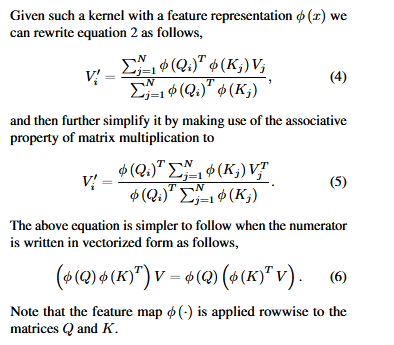
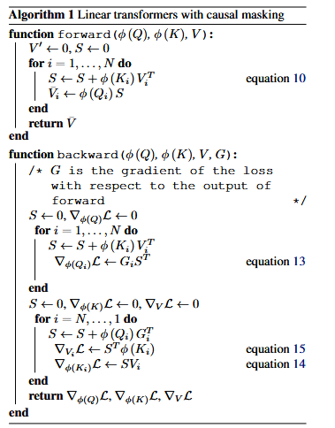

> # Transformers are RNNs: Fast autoregressive transformers with linear attention
>
> * Transformers achieve remarkable performance in several tasks but due to their quadratic complexity, with respect to the input’s length, they are prohibitively slow for very long sequences
> * To address this limitation, we express the self-attention as a linear dot-product of kernel feature maps and make use of the associativity property of matrix products to reduce the complexity from O (N 2) to O (N ), where N is the sequence length.
> * Using Causal Masking
> * Our linear transformers achieve similar performance to vanilla transformers and they are up to 4000x faster on autoregressive prediction of very long sequences.
>
> ## Detail
>
> * 
> * 
